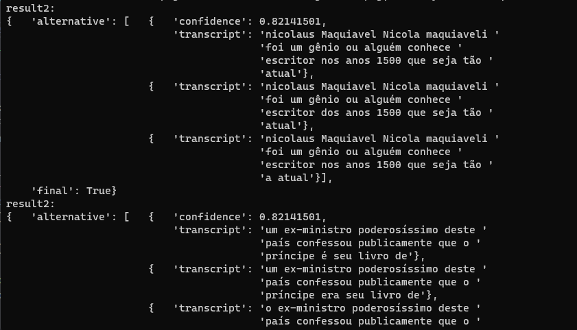

# Projeto de Reconhecimento de Fala em Python

Bem-vindo ao repositório do Projeto de Reconhecimento de Fala em Python! Este projeto demonstra a criação de uma aplicação que utiliza a biblioteca `pyttsx3` e `SpeechRecognition` para realizar o reconhecimento e a síntese de fala.

## Objetivo

O objetivo deste projeto é explorar a tecnologia de reconhecimento de fala, permitindo que você crie uma aplicação interativa capaz de compreender comandos de voz e fornecer respostas de fala.

## Recursos e Destaques

- Reconhecimento de Fala: Utiliza a biblioteca `SpeechRecognition` para transcrever a fala em texto.
- Síntese de Fala: Utiliza a biblioteca `pyttsx3` para converter texto em fala.
- Interação de Voz: A aplicação permite que os usuários forneçam comandos por meio de fala.
- Personalização: A aplicação pode ser adaptada para reconhecer comandos específicos.
- Compatibilidade: Utiliza as versões `pyttsx3==2.90` e `SpeechRecognition==3.9.0`.

## Como Usar

1. Clone ou faça o download do repositório para sua máquina local.
2. Instale as dependências necessárias com `pip install -r requirements.txt`.
3. Execute o script `transcricao.py` em um ambiente Python para transcrever um audio de um arquivo ou `save.py` para gravar seu audio e salva-lo.
4. Siga as instruções para interagir com a aplicação por meio de comandos de voz.
5. Explore o código-fonte para entender como o reconhecimento e a síntese de fala são implementados.

Este projeto é uma excelente maneira de aprender e experimentar o reconhecimento de fala, explorando as bibliotecas `pyttsx3` e `SpeechRecognition` em Python.

## Saída da transcrição:

---

  Feito com ❤️ por Lukas Maia

